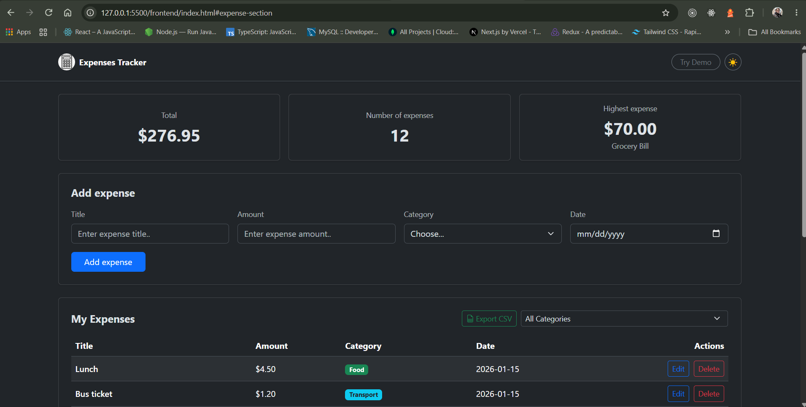
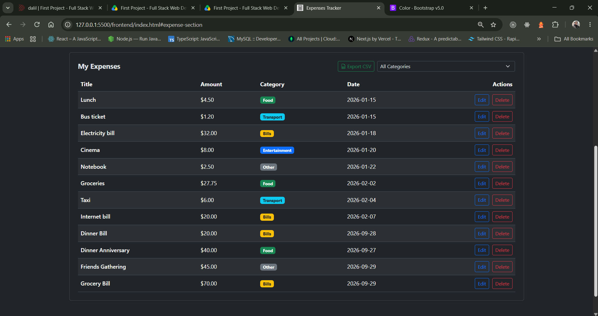
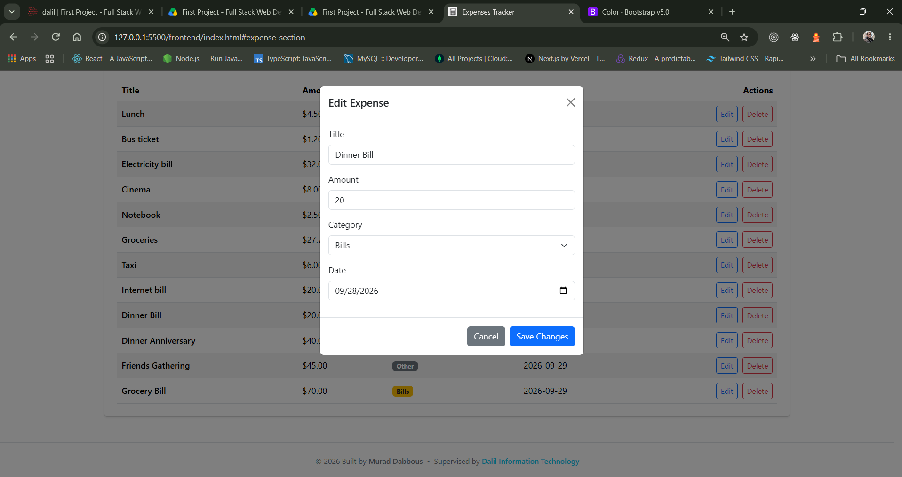

# 💰 Expense Tracker

<!-- Write 1-2 sentences: what does your app do? -->

A web application that allows the user to add and manage their daily expenses through a comprehensive design.

 

## Tech Stack

    

## How to run the app:

<!-- Write the exact steps someone needs to run your project from scratch.
     Assume they have Node.js, PostgreSQL, and VS Code, and nothing else.
     Include: creating the database, running schema.sql, writing the .env file,
     starting the backend, and opening the frontend. -->

**Backend**

1. install the required packages (cors,dotenv,express,pg).
2. open the pgAdmin and open the schema file there and run it to estalish the database and the table.
3. navigate to the correct directiory for the server.js using cd in the terminal.
4. run the server using node path/server.js.

**Frontend**

1. Install an extension live server from VS Code.
2. Navigate to the HTML file and on the bottom of the VS Code click "Go live" to start the live server.
3. The full app will open new window and make sure the server is live and ready simultaniously.

## Features

<!-- List what your app can do. Tick what you finished. -->

- ✅ Add an expense (with validation)
- ✅ Delete an expense
- ✅ Edit an expense
- ✅ Filter by category
- ✅ Summary cards (total, count, highest)
- ✅ Data is saved in a PostgreSQL database
- ✅ Theme toggle dark and light.
- ✅ Save expense data and download them as CSV file

## Screenshots

<!-- Add 2-3 screenshots of your app (desktop and mobile). -->

### Home Page

### The Expense Table

### The Edit Modal

## What was the hardest part?

> It was the POST request on the frontend — figuring out how to set up the headers, the method, and pass the data in JSON format so Express could extract it and add it to the database correctly. This part was completely new to me, so it took a while to understand and research how it's done.

---

_By Murad Dabbous_
